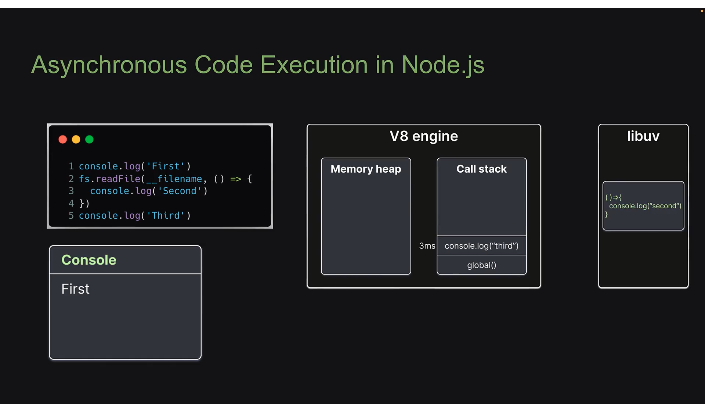

# 事件循环

## 官网简化图

```
   ┌───────────────────────────┐
┌─>│           timers          │
│  └─────────────┬─────────────┘
│  ┌─────────────┴─────────────┐
│  │     pending callbacks     │
│  └─────────────┬─────────────┘
│  ┌─────────────┴─────────────┐
│  │       idle, prepare       │
│  └─────────────┬─────────────┘      ┌───────────────┐
│  ┌─────────────┴─────────────┐      │   incoming:   │
│  │           poll            │<─────┤  connections, │
│  └─────────────┬─────────────┘      │   data, etc.  │
│  ┌─────────────┴─────────────┐      └───────────────┘
│  │           check           │
│  └─────────────┬─────────────┘
│  ┌─────────────┴─────────────┐
└──┤      close callbacks      │
   └───────────────────────────┘

```

## 概念理解



- 事件循环在node服务启动的时候就会运行

- node中的异步处理，是交给libuv来处理的

- 只有在调用堆栈为空后，事件循环才会开始发挥作用。


## 事件循环中，执行顺序遵循的一定规则


- 微任务队列中，nextTick的队列优先级大于promise队列

- 进行一次循环前，会优先执行微任务队列。且每个阶段完成后也会执行微任务队列

## 参考文章

1. [A Complete Visual Guide to Understanding the Node.js Event Loop](https://www.builder.io/blog/visual-guide-to-nodejs-event-loop)
